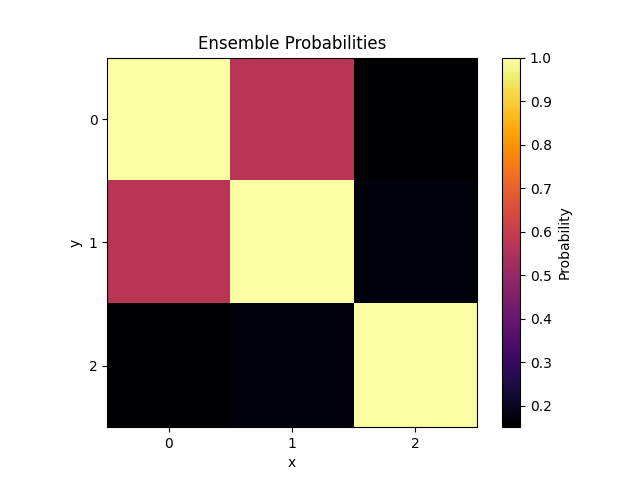

# Entity Matching

## Intent

This repository demonstrates a way to spot similar events from a corpus of news articles.
In literature, the task of matching similar events to one another is referred to as _"entity matching"_.

Usually it's performed on product descriptions which may or may not refer to the same product. This repo, however, aims to showcase a solution to the problem in the context of current events / news.

This solution is by no means state-of-the-art, but it may serve as a nice baseline for comparison with other methods.
Furthermore, it comes with a nice visualisation function which could help make it easier to spot duplicates.



## How To Run

In order to run this repository you need to install the required dependencies.
I recommend using a virtual environment:

```bash
# Create the virtual environment
python -m venv venv

# On Windows
tmp_venv\Scripts\activate

# On macOS and Linux
source tmp_venv/bin/activate
```

Once you have your virtual environment activated, you can install the requirements as such:

```bash
pip install -r requirements.txt
```

Now the only thing left is to run the main `entity_matching.py`:

```bash
venv/bin/python entity_matching.py
```

## Other Files / Thoughts

`ChatGPT_example.txt` serves as an idea on how one could leverage LLMs to extract relational triplets from unstructured text.
These relational triplets could be used to construct knowledge graphs for each text and to compare those graphs to match entity similarities.  
  
I'm interested on working on this in the future, but since it's a large project it may take a while to get to it.
If you're interested on working on this please feel free to let me know.